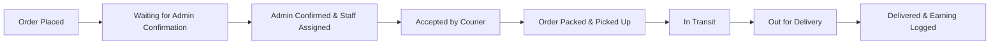

# BookBridge AI — Delivery Staff Module & Order Tracking Setup Guide

This documentation covers the setup, architecture, database schemas, workflows, and testing instructions for the **Delivery Staff Module** and **Visual Order Tracking System** in BookBridge AI.

---

## 1. Overview & Architecture

BookBridge AI integrates a full-stack logistics and delivery staff management system backed by an embedded **SQLite database** (`data/bookbridge.db`). 

Key Features:
- **User Order Tracking Hub**: Visual progress timeline inspired by modern e-commerce platforms, with floating stage tooltips, highlighted progress bars, delivery address details, seller pickup location, staff info, and full event logs.
- **⚡ Advance 1 Day (Demo Simulation)**: Fast-forward button on tracked orders to simulate 6-day delivery progression during live demo presentations.
- **Strict Payment State Boundary**: Successful payment moves orders to `"Waiting for Admin Confirmation"` without automatic delivery staff assignment.
- **Admin Order Dispatch & Staff Assignment**: Administrators manage active orders and assign registered delivery staff based on location/workload.
- **Delivery Staff Portal (`/staff`)**: Delivery partners view assigned deliveries, advance delivery lifecycle states (`ACCEPTED` → `REACHED_SELLER` → `PICKED_UP` → `IN_TRANSIT` → `OUT_FOR_DELIVERY` → `DELIVERED`), and track earnings.
- **Delivery Staff Earnings System**: 50% delivery charge commission credited to delivery staff upon successful package delivery and logged in `staff_earnings`.
- **Nodemailer SMTP Integration**: Automatic email notifications for order status updates, payment confirmations, and tracking links dispatched to buyers and sellers via Gmail SMTP.

---

## 2. Database Schemas (SQLite)

The delivery staff & tracking infrastructure utilizes the following SQLite tables in `data/bookbridge.db`:

### `users`
- Stores user credentials, roles (`USER`, `ADMIN`, `DELIVERY_STAFF`), and status (`ACTIVE`, `BLOCKED`).

### `delivery_staff`
- `id` (TEXT PRIMARY KEY)
- `user_id` (TEXT FOREIGN KEY)
- `name` (TEXT)
- `phone` (TEXT)
- `city` (TEXT)
- `area` (TEXT)
- `pincode` (TEXT)
- `service_area` (TEXT)
- `availability` (INTEGER 0/1)
- `active_deliveries` (INTEGER)

### `deliveries`
- `id` (TEXT PRIMARY KEY)
- `order_id` (TEXT FOREIGN KEY)
- `staff_id` (TEXT FOREIGN KEY)
- `status` (TEXT: `PENDING`, `ASSIGNED`, `ACCEPTED`, `REACHED_SELLER`, `PICKED_UP`, `IN_TRANSIT`, `OUT_FOR_DELIVERY`, `DELIVERED`, `CANCELLED`)
- `delivery_charge` (REAL)
- `delivery_address` (TEXT)
- `pickup_address` (TEXT)

### `staff_earnings`
- `id` (TEXT PRIMARY KEY)
- `staff_id` (TEXT FOREIGN KEY)
- `delivery_id` (TEXT FOREIGN KEY)
- `order_id` (TEXT FOREIGN KEY)
- `delivery_charge` (REAL)
- `earning_amount` (REAL)
- `status` (TEXT: `EARNED`, `PAID`)
- `created_at` (TEXT)

### `delivery_tracking_events`
- `id` (TEXT PRIMARY KEY)
- `order_id` (TEXT FOREIGN KEY)
- `delivery_id` (TEXT FOREIGN KEY)
- `status` (TEXT)
- `stage_name` (TEXT)
- `location_name` (TEXT)
- `description` (TEXT)
- `event_time` (TEXT)
- `created_at` (TEXT)

---

## 3. Standard Delivery Lifecycle & Stages



---

## 4. Test Accounts & Credentials

| Role | Email | Password | Access Route |
| :--- | :--- | :--- | :--- |
| **Buyer** | `user@bookbridge.com` | `user123` | `/dashboard/tracking` |
| **Delivery Staff Partner** | `staff@bookbridge.com` | `staff123` | `/staff` |
| **Administrator** | `admin@bookbridge.com` | `admin123` | `/admin/orders` |

---

## 5. Email Notification Configuration

Configure `.env.local` with Gmail SMTP credentials:

```env
GMAIL_USER=dajitha12@gmail.com
GMAIL_APP_PASSWORD=nwiw nyzh kgsf fvuo
NEXT_PUBLIC_APP_URL=http://localhost:3000
```

---

## 6. How to Run & Verify

1. Start development server:
   ```bash
   npm run dev
   ```
2. Navigate to `http://localhost:3000/login` and log in as **Buyer** (`user@bookbridge.com`).
3. Place an order or visit `/dashboard/tracking` to view the visual timeline.
4. Click **⚡ Advance 1 Day (Demo Simulation)** to test stage progression and live updates.
5. Log in as **Admin** (`admin@bookbridge.com`) to assign staff from `/admin/orders`.
6. Log in as **Delivery Staff** (`staff@bookbridge.com`) at `/staff` to update package status and inspect earnings at `/staff/earnings`.
